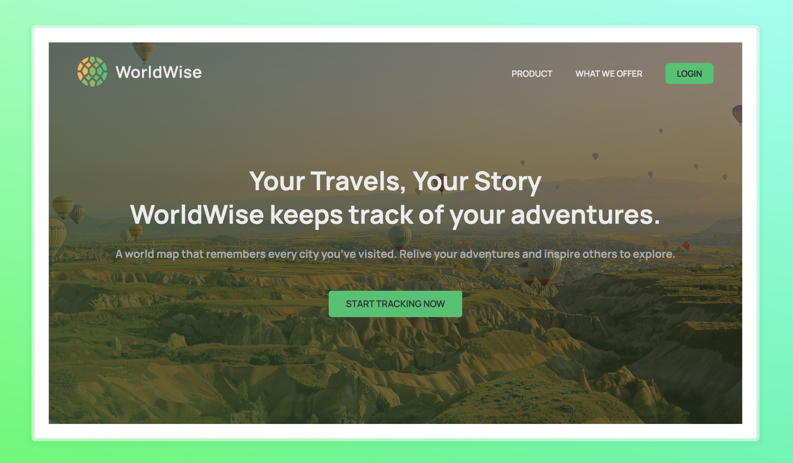
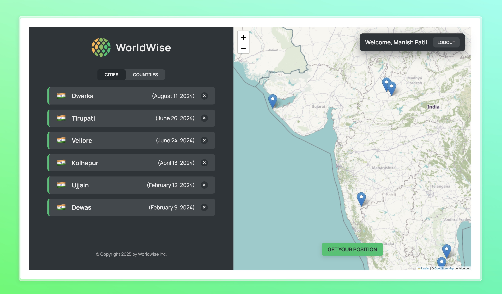

# 🌍 Worldwise | Keep Track of Your Adventures

**Worldwise** is a MERN-based travel tracker that helps users document their journeys, log their visited locations, and relive their adventures.

📍 **Track your travels** | ✈️ **Plan your next journey** | 🌎 **Share your experiences**

---

## 🚀 Features

✔️ **User Authentication (Login/Signup)**  
✔️ **Interactive Travel Dashboard**  
✔️ **Add & Manage Travel Locations**  
✔️ **Map Integration (Leaflet)**  
✔️ **Data Persistence with MongoDB**  
✔️ **Secure & Fast MERN Stack Implementation**

---

## 📸 Dashboard Preview (After Login)

---

## 🛠️ Tech Stack

| Technology             | Description                                   |
| ---------------------- | --------------------------------------------- |
| **MongoDB**            | NoSQL Database for storing travel logs        |
| **Express.js**         | Backend framework for handling API requests   |
| **React.js**           | Frontend framework for building UI components |
| **Node.js**            | JavaScript runtime for backend                |
| **Leaflet**            | Display interactive maps                      |
| **JWT Authentication** | Secure user authentication                    |

## 📌 Future Enhancements

- Social Media Sharing
- Travel Buddies (Invite Friends)
- Trip Budgeting & Expenses Tracking
- AI-Powered Travel Suggestion

⭐ Star the repository if you find it useful! 🚀
